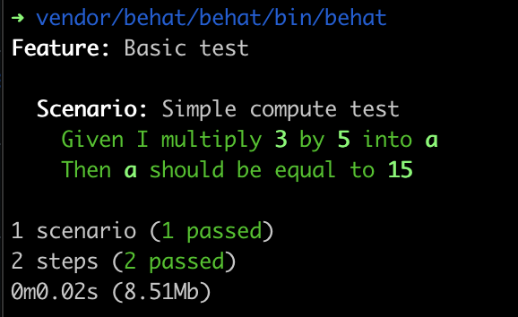

# Requirements
To run this project you will need a computer with PHP and composer installed.

# Install
To install the project, you just have to run `composer install` to get all the dependencies

# Running the tests
After installing the dependencies you can run the tests with this command `vendor/behat/behat/bin/behat`.
The result should look like this :


# Step 1 :
- Version PHP : 8.2.28
- Running the tests with **in-memory persistance** :
```
vendor/behat/behat/bin/behat --tags="@in-memory"
```